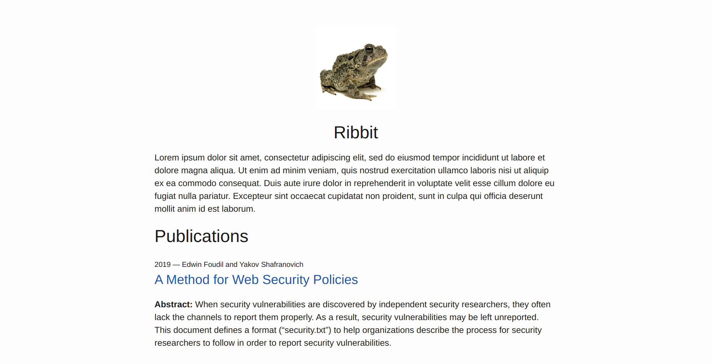

<div align="center">

</div>
<h1 align="center">Propaganda</h1>

An interactive Shell script that generates a personal Jekyll website with links to your various publications by using Bibtex references.

```
                                Bibtex → YAML → _config.yml → Jekyll
```



## Installation

`propaganda` depends on [`pandoc-citeproc`](https://github.com/jgm/pandoc-citeproc) to generate the YAML frontmatter from Bibtex files. This plugin comes preinstalled with [pandoc](https://pandoc.org/).

Make sure you have [Jekyll](https://jekyllrb.com/) installed on your machine. Please refer to the installation page for more information: https://jekyllrb.com/docs/installation/.

## Usage

You can use the interactive `propaganda` Shell script to generate your website.

```
$ ./propaganda 
Title of website: propaganda
Your email address: contact@example.com
Link to profile pic: https://i.imgur.com/XjjuOdg.png
Your description: Lorem ipsum dolor ...
Your Twitter handle: Twitter
Your GitHub handle: GitHub
Name of bibtex file: text.bib
Navigate to http://localhost:4000/ to see your website.
```

Once you are done, simply navigate to http://localhost:4000/ to view your website.

<a href="https://www.buymeacoffee.com/edoverflow" target="_blank"></a>
